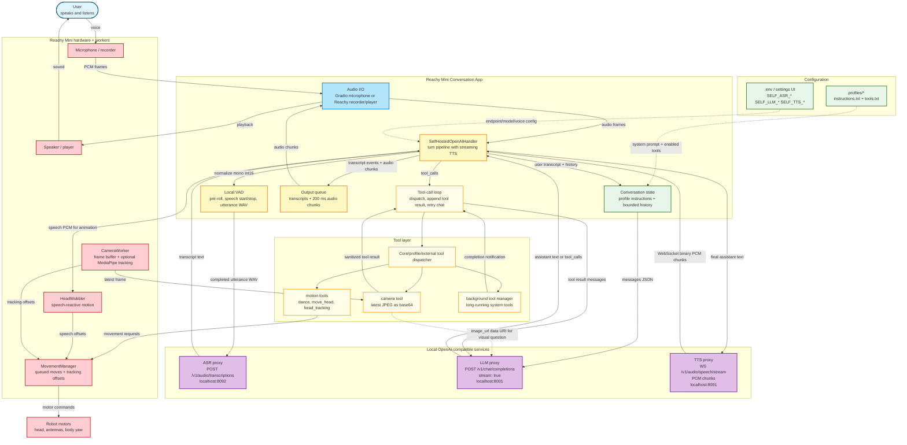

# Reachy Mini conversation app

Conversational app for the Reachy Mini robot using self-hosted OpenAI-compatible ASR, chat completions, and TTS services, plus camera tools and choreographed motion.

## Table of contents
- [Overview](#overview)
- [Architecture](#architecture)
- [Installation](#installation)
- [Configuration](#configuration)
- [Running the app](#running-the-app)
- [LLM tools](#llm-tools-exposed-to-the-assistant)
- [Advanced features](#advanced-features)
- [Contributing](#contributing)
- [License](#license)

## Overview
- Turn-based voice loop with local VAD and self-hosted OpenAI-compatible ASR/LLM/TTS services:
  - `POST /v1/audio/transcriptions` for ASR.
  - `POST /v1/chat/completions` with `stream=true` for LLM responses and tool calls.
  - `WS /v1/audio/speech/stream` for streaming TTS PCM chunks.
- Camera-tool images are forwarded to your configured OpenAI-compatible LLM as multimodal chat content when the assistant asks to inspect a frame.
- Layered motion system queues primary moves (dances, goto poses, breathing) while blending speech-reactive wobble and head-tracking.
- Async tool dispatch integrates robot motion, camera capture, and optional head-tracking capabilities through a Gradio web UI with live transcripts.

## Architecture

The app follows a turn pipeline connecting local audio capture, VAD, your self-hosted OpenAI-compatible ASR/LLM/TTS services, tool handlers, motion control, camera capture, and robot hardware. ASR and LLM are request/response calls; TTS uses WebSocket streaming. The editable Mermaid source is in `docs/scheme.mmd`.



## Installation

> [!IMPORTANT]
> Before using this app, you need to install [Reachy Mini's SDK](https://github.com/pollen-robotics/reachy_mini/).<br>
> Windows support is currently experimental and has not been extensively tested. Use with caution.

<details open>
<summary><b>Using uv (recommended)</b></summary>

Set up the project quickly using [uv](https://docs.astral.sh/uv/):

```bash
# macOS (Homebrew)
uv venv --python /opt/homebrew/bin/python3.12 .venv

# Linux / Windows (Python in PATH)
uv venv --python python3.12 .venv

source .venv/bin/activate
uv sync
```

> **Note:** To reproduce the exact dependency set from this repo's `uv.lock`, run `uv sync --frozen`. This ensures `uv` installs directly from the lockfile without re-resolving or updating any versions.

**Install optional features:**
```bash
uv sync --extra mediapipe_vision     # MediaPipe-based head-tracking
uv sync --extra all_vision           # All retained vision/head-tracking features
```

Combine extras or include dev dependencies:
```bash
uv sync --extra all_vision --group dev
```

</details>

<details>
<summary><b>Using pip</b></summary>

```bash
python -m venv .venv
source .venv/bin/activate
pip install -e .
```

**Install optional features:**
```bash
pip install -e .[mediapipe_vision]      # MediaPipe-based vision
pip install -e .[all_vision]            # All retained vision/head-tracking features
pip install -e .[dev]                   # Development tools
```

Some optional wheels are platform-specific, so make sure your platform matches the binaries pulled in by each extra.

</details>

### Optional dependency groups

| Extra | Purpose | Notes |
|-------|---------|-------|
| `mediapipe_vision` | Lightweight landmark tracking with MediaPipe | Works on CPU. Enables `--head-tracker mediapipe`. |
| `all_vision` | Convenience alias for retained vision/head-tracking extras | Currently installs MediaPipe support. |
| `dev` | Developer tooling (`pytest`, `ruff`, `mypy`) | Development-only dependencies. Use `--group dev` with uv or `[dev]` with pip. |

**Note:** `dev` is a dependency group (not an optional dependency). With uv, use `--group dev`. With pip, use `[dev]`.

## Configuration

The app contains only the self-hosted OpenAI-compatible ASR, LLM, and TTS pipeline. Legacy third-party model backends and local third-party model paths have been removed.

Copy `.env.example` to `.env` and point the service URLs at your local or LAN endpoints.

| Variable | Description |
|----------|-------------|
| `SELF_OPENAI_BASE_URL` | Shared OpenAI-compatible `/v1` base URL used by ASR, LLM, and TTS unless overridden. |
| `SELF_OPENAI_API_KEY` | Shared bearer token. Defaults to `DUMMY` for local servers. |
| `SELF_ASR_BASE_URL` / `SELF_ASR_API_KEY` / `SELF_ASR_MODEL` | Optional ASR endpoint, token, and model. |
| `SELF_LLM_BASE_URL` / `SELF_LLM_API_KEY` / `SELF_LLM_MODEL` | Optional chat-completions endpoint, token, and model. |
| `SELF_TTS_BASE_URL` / `SELF_TTS_API_KEY` / `SELF_TTS_MODEL` | Optional TTS endpoint, token, and model. |
| `SELF_TTS_VOICE` / `SELF_TTS_VOICES` / `SELF_TTS_LANGUAGE` | Default voice, comma-separated UI voice list, and optional TTS language field. |
| `SELF_TTS_RESPONSE_FORMAT` | Legacy REST TTS decode format. The streaming WebSocket path always sends `response_format=pcm`. |
| `SELF_TTS_SEND_RESPONSE_FORMAT` | Legacy REST TTS flag retained for compatibility with older settings. The streaming WebSocket path ignores it. |
| `SELF_VAD_*` | Local VAD thresholds and timing used to decide when to call ASR. |

```env
SELF_OPENAI_BASE_URL=http://127.0.0.1:8000/v1
SELF_OPENAI_API_KEY=DUMMY
SELF_ASR_MODEL=whisper-1
SELF_LLM_MODEL=local-model
SELF_TTS_MODEL=
SELF_TTS_VOICE=default
SELF_TTS_LANGUAGE=English
```

## Running the app

Activate your virtual environment, then launch:

```bash
reachy-mini-conversation-app
```

> [!TIP]
> Make sure the Reachy Mini daemon is running before launching the app. If you see a `TimeoutError`, it means the daemon isn't started. See [Reachy Mini's SDK](https://github.com/pollen-robotics/reachy_mini/) for setup instructions.

The app runs in console mode by default. Add `--gradio` to launch a web UI at http://127.0.0.1:7860/ (required for simulation mode). Without Reachy Mini hardware, use `--test-ui` to launch a separate local pipeline test page that skips robot, VAD, camera, and movement setup.

### CLI options

| Option | Default | Description |
|--------|---------|-------------|
| `--head-tracker {mediapipe}` | `None` | Enable MediaPipe head tracking when a camera is available. Requires the `mediapipe_vision` extra. |
| `--no-camera` | `False` | Run without camera capture or head tracking. |
| `--gradio` | `False` | Launch the Gradio web UI. Without this flag, runs in console mode. Required when running in simulation mode. |
| `--test-ui` | `False` | Launch the hardware-free Gradio test UI for the local ASR/LLM/TTS services. |
| `--server-name` | `None` | Optional Gradio host for `--test-ui`, for example `0.0.0.0`. |
| `--server-port` | `None` | Optional Gradio port for `--test-ui`. |
| `--robot-name` | `None` | Optional. Connect to a specific robot by name when running multiple daemons on the same subnet. See [Multiple robots on the same subnet](#advanced-features). |
| `--debug` | `False` | Enable verbose logging for troubleshooting. |

### Examples

```bash
# Run with MediaPipe head tracking
reachy-mini-conversation-app --head-tracker mediapipe

# Audio-only conversation (no camera)
reachy-mini-conversation-app --no-camera

# Launch with Gradio web interface
reachy-mini-conversation-app --gradio

# Launch hardware-free local pipeline tests
reachy-mini-conversation-app --test-ui --server-port 7860
```

The test UI has two tabs:

| Tab | Pipeline |
|-----|----------|
| `Text -> LLM -> TTS` | Text input streams `/v1/chat/completions` chunks directly into `/v1/audio/speech/stream`. |
| `Audio -> ASR -> LLM -> TTS` | Uploaded audio calls `/v1/audio/transcriptions`, then streams `/v1/chat/completions` chunks directly into `/v1/audio/speech/stream`. |

## LLM tools exposed to the assistant

| Tool | Action | Dependencies |
|------|--------|--------------|
| `move_head` | Queue a head pose change (left/right/up/down/front). | Core install only. |
| `camera` | Capture the latest camera frame and forward it to the self-hosted LLM as OpenAI-compatible multimodal chat content. | Requires camera worker and an LLM that accepts image input for visual answers. |
| `head_tracking` | Enable or disable head-tracking offsets (not identity recognition - only detects and tracks head position). | Camera worker with configured head tracker (`--head-tracker`). |
| `dance` | Queue a dance from `reachy_mini_dances_library`. | Core install only. |
| `stop_dance` | Clear queued dances. | Core install only. |
| `idle_do_nothing` | Explicitly remain idle during an idle turn. Not intended for normal conversation turns. | Core install only. |

## Advanced features

<details>
<summary><b>Custom profiles</b></summary>

Create custom profiles with dedicated instructions and enabled tools.

For normal usage, select a profile from the UI and save it for startup. That selection is persisted in `startup_settings.json`.

If no startup settings have been saved yet, you can still seed startup from the environment with `REACHY_MINI_CUSTOM_PROFILE=<name>` to load `profiles/<name>/`. If neither is set, the `default` profile is used.

Each profile should include `instructions.txt` (prompt text). `tools.txt` (list of allowed tools) is recommended. If missing for a non-default profile, the app falls back to `profiles/default/tools.txt`. Profiles can optionally contain custom tool implementations.

**Custom instructions:**

Write plain-text prompts in `instructions.txt`. To reuse shared prompt pieces, add lines like:
```
[passion_for_lobster_jokes]
[identities/witty_identity]
```
Each placeholder pulls the matching file under `src/reachy_mini_conversation_app/prompts/` (nested paths allowed). See `profiles/example/` for a reference layout.

**Enabling tools:**

List enabled tools in `tools.txt`, one per line. Prefix with `#` to comment out:
```
dance
# move_head

# My custom tool defined locally
sweep_look
```
Tools are resolved first from Python files in the profile folder (custom tools), then from the core library `src/reachy_mini_conversation_app/tools/` (like `dance`, `head_tracking`).

**Custom tools:**

On top of built-in tools found in the core library, you can implement custom tools specific to your profile by adding Python files in the profile folder.
Custom tools must subclass `reachy_mini_conversation_app.tools.core_tools.Tool` (see `profiles/example/sweep_look.py`).

**Edit personalities from the UI:**

When running with `--gradio`, open the "Personality" accordion:
- Select among available profiles (folders under `profiles/`) or the built‑in default.
- Click "Apply" to update the current session instructions live.
- Create a new personality by entering a name and instructions text. It stores files under `profiles/<name>/` and copies `tools.txt` from the `default` profile.

Note: The "Personality" panel updates the conversation instructions. Tool sets are loaded at startup from `tools.txt` and are not hot‑reloaded.

</details>

<details>
<summary><b>Locked profile mode</b></summary>

To create a locked variant of the app that cannot switch profiles, edit `src/reachy_mini_conversation_app/config.py` and set the `LOCKED_PROFILE` constant to the desired profile name:
```python
LOCKED_PROFILE: str | None = "mars_rover"  # Lock to this profile
```
When `LOCKED_PROFILE` is set, the app always uses that profile, ignoring saved startup settings, `REACHY_MINI_CUSTOM_PROFILE`, and the Gradio UI. The UI shows "(locked)" and disables all profile editing controls.
This is useful for creating dedicated clones of the app with a fixed personality. Clone scripts can simply edit this constant to lock the variant.

</details>

<details>
<summary><b>External profiles and tools</b></summary>

You can extend the app with profiles/tools stored outside the repository defaults.

- Core profiles are under `profiles/`.
- Core tools are under `src/reachy_mini_conversation_app/tools/`.

**Recommended layout:**

```text
external_content/
├── external_profiles/
│   └── my_profile/
│       ├── instructions.txt
│       ├── tools.txt        # optional (see fallback behavior below)
│       └── voice.txt        # optional
└── external_tools/
    └── my_custom_tool.py
```

**Environment variables:**

Set these values in your `.env` when you want env-driven external profile/tool selection:

```env
# Optional fallback/manual profile selector:
REACHY_MINI_CUSTOM_PROFILE=my_profile
REACHY_MINI_EXTERNAL_PROFILES_DIRECTORY=./external_content/external_profiles
REACHY_MINI_EXTERNAL_TOOLS_DIRECTORY=./external_content/external_tools
# Optional convenience mode:
# AUTOLOAD_EXTERNAL_TOOLS=1
```

**Loading behavior:**

- **Default/strict mode**: `tools.txt` defines enabled tools explicitly. Every name in `tools.txt` must resolve to either a built-in tool (`src/reachy_mini_conversation_app/tools/`) or an external tool module in `REACHY_MINI_EXTERNAL_TOOLS_DIRECTORY`.
- **Convenience mode** (`AUTOLOAD_EXTERNAL_TOOLS=1`): all valid `*.py` tool files in `REACHY_MINI_EXTERNAL_TOOLS_DIRECTORY` are auto-added.
- **External profile fallback**: if the selected external profile has no `tools.txt`, the app falls back to built-in `profiles/default/tools.txt`.

This supports both:
1. Downloaded external tools used with built-in/default profile.
2. Downloaded external profiles used with built-in default tools.

</details>

<details>
<summary><b>Multiple robots on the same subnet</b></summary>

If you run multiple Reachy Mini daemons on the same network, use:

```bash
reachy-mini-conversation-app --robot-name <name>
```

`<name>` must match the daemon's `--robot-name` value so the app connects to the correct robot.

</details>

## Contributing

We welcome bug fixes, features, profiles, and documentation improvements. Please review our
[contribution guide](CONTRIBUTING.md) for branch conventions, quality checks, and PR workflow.

Quick start:
- Fork and clone the repo
- Follow the [installation steps](#installation) (include the `dev` dependency group)
- Run contributor checks listed in [CONTRIBUTING.md](CONTRIBUTING.md)

## License

Apache 2.0
